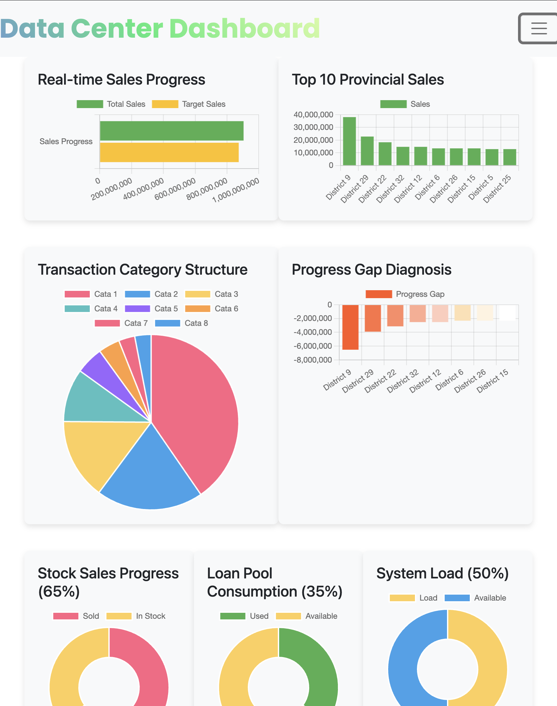
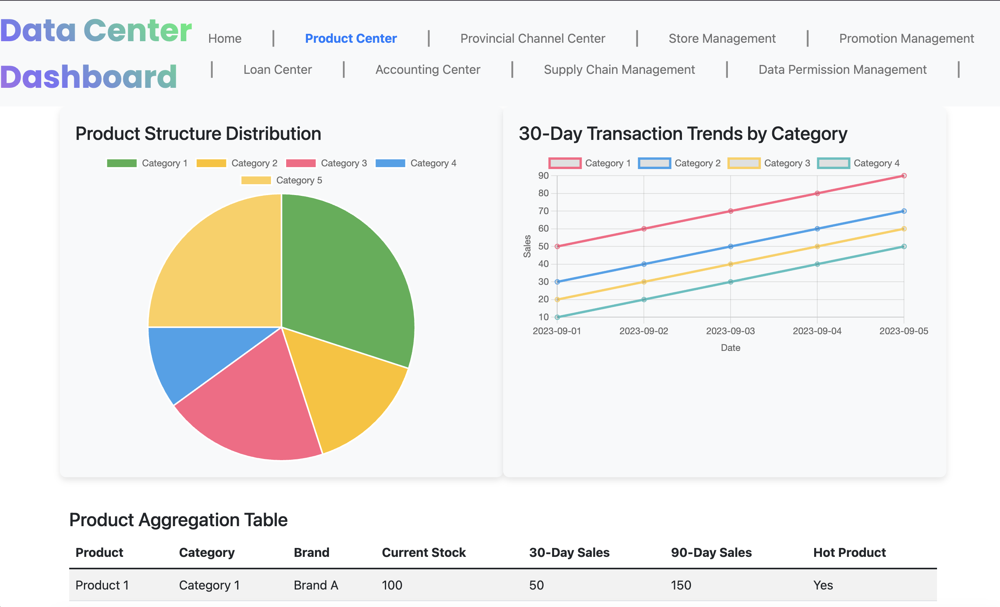
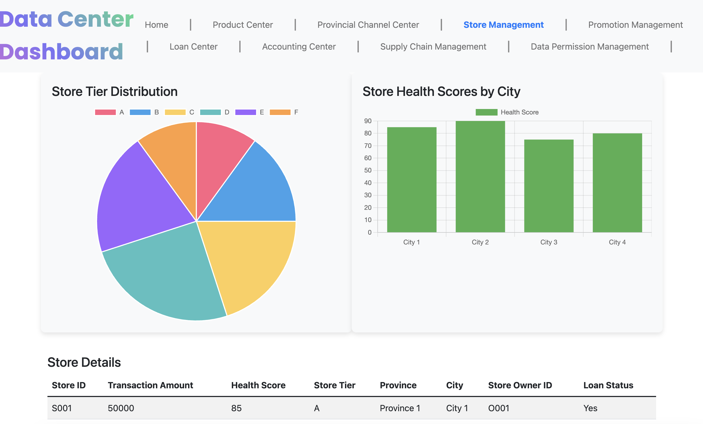
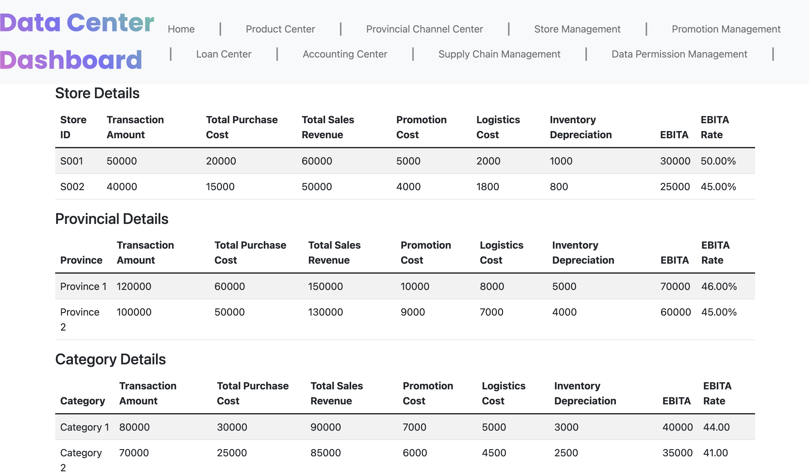

# XiangyuProjects


__DISCLAIMER__
- The data and scenarios presented in this project are entirely fictional and have been generated solely for demonstration purposes.
- All datasets used are mock data, created through scripts to illustrate specific data analysis methods and techniques. 
- None of the data structures, analysis methods, or results should be interpreted as reflective of actual data, operations, or assets of Alibaba or any other organization. 
- This project is not representative of any proprietary or confidential information from Alibaba or any real-world entity. 
- Any resemblance to real-world data is purely coincidental.

Data Center Development

- Business Data Foundation: Establishing core data infrastructure for an independent business, supporting essential operational metrics.
- Product Center: Centralized product data management, including inventory, sales, and product performance.

- Channel Center: Tracking sales and distribution across multiple channels, with real-time insights into channel performance.
- Store Management: Managing store operations data, including sales performance, health scores, and loan management.

- Accounting Management: Comprehensive financial tracking, including transaction amounts, purchase costs, revenue, and other financial metrics for profitability analysis.



# Project Overview

## Project Dependencies
The project dependencies listed in `requirements.txt` are as follows:

```text
Flask==3.0.3
numpy==2.1.1
pandas==2.2.2
```

## Project Directory Structure
The structure of the project is as follows:

```text
- ./
    - LICENSE
    - requirements.txt
    - READMEtmp.md
    - Dockerfile
    - Makefile
    - README.md
    - readme_gnr.py
    - app.py
    - images/
        - storeManagement.png
        - accounting.png
        - Home.png
        - productCenter.png
    - __pycache__/
    - static/
        - charts.js
    - templates/
        - supply_chain_management.html
        - navbar.html
        - base.html
        - dashboard.html
        - accounting_center.html
        - data_permission_management.html
        - promotion_management.html
        - loan_center.html
        - product_center.html
        - store_management.html
        - provincial_channel_center.html
    - ODPSmocker/
        - dataMocker.py
    - data/
        - store_data.csv
        - transaction_data.csv
```
